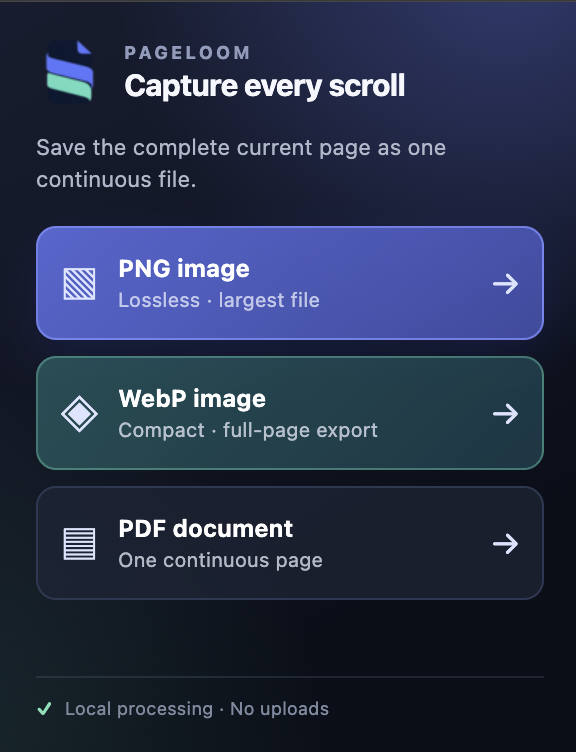

<p align="center">
  
</p>

<h1 align="center">P A G E L O O M</h1>

<p align="center"><strong>Capture every scroll. Keep every detail.</strong></p>

<p align="center">
  A lightweight Chrome extension that saves the complete current web page as one continuous PNG or PDF.
</p>

<p align="center">
  
  
  
  
</p>

<p align="center">
  <a href="#install">Install</a> ·
  <a href="#features">Features</a> ·
  <a href="#how-it-works">How it works</a> ·
  <a href="#privacy">Privacy</a>
</p>

---

<p align="center">
  
</p>

## Capture the whole story

PageLoom scrolls through the active tab, stitches every viewport together, and downloads the result as one continuous image or document. No account, analytics, or cloud processing required.

| PNG image | WebP image | PDF document |
| --- | --- | --- |
| Lossless quality for design review and archival. | Compact image output with excellent visual quality. | A portable, single-page record of a long page. |
| Largest file size. | Best choice when file size matters. | JPEG-compressed to balance quality and size. |

## Features

- **Full-page capture** — captures the entire active page, not only what is visible.
- **Three output formats** — download a lossless PNG, a compact WebP image, or a single continuous PDF page.
- **Clean stitching** — keeps the header in the first viewport while preventing fixed and sticky UI from repeating further down.
- **Footer-aware** — waits for lazy-loaded content and page footers before completing the capture.
- **State restoration** — restores scrollbars, fixed UI, and the original scroll position after capture.
- **Local by design** — capture, stitching, and file generation occur entirely in Chrome.
- **Duplicate protection** — prevents a second capture from starting while one is already running.

## Install

1. Clone or download this repository.
2. Open `chrome://extensions` in Chrome.
3. Enable **Developer mode** in the top-right corner.
4. Click **Load unpacked** and select the folder containing `manifest.json`.
5. Open a page, click the PageLoom extension icon, then choose **PNG image**, **WebP image**, or **PDF document**.

After editing the source, use the reload button on PageLoom's extension card in `chrome://extensions`.

## How it works

```text
Open PageLoom
      ↓
Capture the first viewport with its header
      ↓
Hide repeating fixed/sticky UI and scrollbars
      ↓
Capture and stitch the remaining viewports
      ↓
Restore the page and download one PNG or PDF
```

## Long pages

Browsers impose maximum canvas and PDF page dimensions. For exceptionally tall pages, PageLoom proportionally downscales the final result to keep every part of the page in one output image or PDF page. It does not intentionally split a capture into multiple files or PDF pages. WebP uses a more conservative maximum height than PNG to ensure reliable full-page encoding while keeping file sizes small.

## Permissions

| Permission | Purpose |
| --- | --- |
| `activeTab` | Accesses only the tab where the user explicitly invokes PageLoom. |
| `scripting` | Measures and scrolls the page, then temporarily hides repeated UI. |
| `downloads` | Saves the generated PNG or PDF through Chrome's download system. |

PageLoom does not request broad host permissions such as `<all_urls>`.

## Privacy

**Your page stays on your device.**

- No analytics, tracking, sign-in, or external API calls.
- No page content, screenshots, URLs, or browsing history are uploaded or shared.
- All processing happens locally in Chrome before the final file is saved.

## Limitations

- Chrome internal pages such as `chrome://`, the Chrome Web Store, and some protected pages cannot be captured due to browser security restrictions.
- Continuously changing page content can affect capture alignment.
- PageLoom captures up to 50 loaded viewports per export, preventing infinite or virtualized feeds from running indefinitely. Longer pages are saved as the currently loaded portion. You can also cancel an active capture from the popup.
- Chrome's **Ask where to save each file before downloading** setting may still show a system save dialog. Disable it in `chrome://settings/downloads` for automatic saving.

## Project structure

```text
manifest.json   Extension manifest and permissions
background.js   Capture, stitching, PDF generation, and download logic
popup.html      Popup markup
popup.css       Popup styling
popup.js        Popup interaction logic
icons/          PageLoom browser and store icons
```

## License

Released under the [MIT License](LICENSE).
